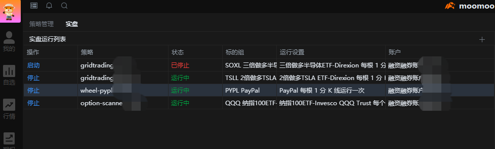

授人以鱼不如授人以渔。本文不会直接给你代码，而是通过一系列思考题，引导你自主探索、理解和改造策略。从突破限制到个性化设计，让我们一起踏上从使用者到创造者的进阶之路。

<!-- more -->

## 🎧 音频版本

如果您更喜欢收听而非阅读，我们提供了本文的音频版本：

📹 **YouTube播客**：[点击收听](https://youtu.be/example){:target="_blank"}
⏱️ **时长**：约20分钟
🎯 **适合场景**：通勤路上、运动时、做家务时

---

## 系列文章导航

本文是TQQQ定投策略系列的第3篇（完结篇）：
- 第1篇：[回测分析——从-60%回撤到盈利](https://zhurong2020.github.io/youxinyanzhe/posts/2025/09/from-60-percent-drawdown-to-profit-turnaround/){:target="_blank"}
- 第2篇：[TQQQ定投深度剖析：为什么周投能赢日投？](https://zhurong2020.github.io/youxinyanzhe/posts/2025/09/tqqq-weekly-vs-daily-analysis/){:target="_blank"}
- **第3篇：开源定投策略改造指南**（本文）

---

## 引言：AI时代的策略改造新方法

在前两篇文章中，我们展示了定投策略的威力。但更重要的是：**如何理解策略原理，创建适合自己的定投系统**。

> "The best way to learn is to teach a machine to do it for you."
> — 现代量化投资者

**本文的核心方法**：
- ✅ 利用AI（比如ChatGPT或者国内LLM模型）理解代码
- ✅ 在Web端（或者更专业的VS Code）中借助AI改造策略
- ✅ 通过向大语言模型（LLM）提问引导思考和改造方向
- ✅ 让AI成为你的编程助手并实现自定义策略的私人定制

**推荐阅读**：
- [智能投资指南：手把手教你用量化工具定投美股](https://zhurong2020.github.io/post/zhi-neng-tou-zi-zhi-nan-shou-ba-shou-jiao-ni-yong-liang-hua-gong-ju-ding-tou-mei-gu/){:target="_blank"}
- [打造你的第一个量化交易机器人-Moomoo平台环境搭建指南](https://zhurong2020.github.io/post/da-zao-ni-de-di-yi-ge-liang-hua-jiao-yi-ji-qi-ren-moomoo-ping-tai-huan-jing-da-jian-zhi-nan/){:target="_blank"}

## 1. 为什么选择Moomoo平台

### 1.1 Moomoo量化功能介绍

**为什么是Moomoo？**
- 📱 **自定义策略支持**：Moomoo提供完整的量化功能模块
- 💻 **代码导入能力**：可直接导入自己编写的Python策略代码
- 🆓 **免费使用**：量化功能完全免费，无需额外付费
- 🎯 **实盘执行**：策略可直接用于实盘交易，自动执行定投

**工作原理**：
1. 在Moomoo软件中打开"量化"功能
2. 选择"自定义策略"
3. 将免费版代码（或自己改造的代码）粘贴进去
4. 启动策略，即可实现自动定投等功能
5. 无需编程基础，复制粘贴即可使用

> 💡 **核心价值**：本系列分享的免费版策略就是基于Moomoo量化框架开发的，可以直接在Moomoo中运行。

### 1.2 平台准备与框架理解

> ⚠️ **开户提醒**：
> - 目前Moomoo等券商已收紧新开户要求，如遇问题请和在线客服联系。
> - 开户时可能需要提供国外身份证明，具体以Moomoo官方解释为准。
> - 建议先确认开户资格，再下载软件并通过新手引导流程进行学习。
>
> 📚 **版本选择**：
> - 推荐使用**Moomoo Windows Legacy版本**
> - 下载时选择带有Legacy标记的版本（如Ver.15.33.19958）
> - Legacy版本量化功能更稳定

**第一步：理解框架结构**

打开Moomoo量化功能（初次使用有功能引导），点击右上角"查看量化文档"，了解一些约定。

**AI修改策略代码的入门方法（最简单）**：

*国外AI工具*：
- [Claude.ai](https://claude.ai) - Anthropic的AI助手
- [ChatGPT](https://chat.openai.com) - OpenAI的对话AI

*国内AI工具*：
- [文心一言](https://yiyan.baidu.com) - 百度，中文理解能力强
- [通义千问](https://tongyi.aliyun.com) - 阿里云，支持多种智能体
- [讯飞星火](https://xinghuo.xfyun.cn) - 科大讯飞，语音交互强
- [Kimi](https://kimi.moonshot.cn) - 长文本处理能力优秀
- [智谱清言](https://chatglm.cn) - 清华背景，数据分析能力强

使用步骤：
1. 选择任一AI工具
2. 复制免费版代码给AI
3. 通过对话了解代码

**进阶方法（更专业）**：
1. 使用VS Code打开已下载的策略代码（扩展名为quant文件）
2. 在VS Code中安装AI插件（如Claude Code、ChatGPT等）
3. 在安装好的编辑器内直接询问AI（初学者可以关注后续文章）

**与AI的对话示例**：
```
你："请解释这个Moomoo策略的整体结构"
AI："这个策略包含三个层面：基础框架函数（initialize和handle_data）..."
```

### 1.2 AI辅助理解核心概念

**高效学习方法**：

1. **复制关键函数给AI分析**：
```
你："根据Moomoo文档，trigger_symbols()函数是做什么的？最多可以设置几个？"
提示：将文档中trigger_symbols部分一起发给AI
AI："这个函数定义运行标的，最多可以设置8个..."
```

2. **让AI生成注释版代码**：
```
你："请为这段代码添加详细的中文注释"
提示：把策略代码粘贴给AI
AI："好的，我来为每个函数添加注释说明..."
```

> 💎 **完整版福利**：
> 购买完整版的用户将获得：
> - 📄 《Moomoo量化策略框架具体说明》整理版
> - 📄 《Moomoo量化功能常用API函数及其用法》（46个常用函数详解）
> - 避免走弯路，节省大量查找时间

## 2. 为什么需要量化策略？

### 2.1 一个常见的疑问

> "就为了每天定投一次，需要自己创建自定义策略这么复杂吗？我直接手动买某个股票不就行了？"

这是许多投资者的第一反应。让我们看看手动定投vs量化定投的真实差异：

**手动定投的现实**：
- 😰 **每日纠结**："今天涨了2%，要不要等回调？"
- 😟 **执行困难**："忙忘了...已经3天没投了"
- 😵 **情绪干扰**："跌了20%，太可怕了，先停停吧"
- 🤔 **决策疲劳**："到底该投多少？要不要加仓？"

**量化策略的优势**：
- ✅ **零纠结**：策略自动判断，无需思考
- ✅ **100%执行**：只要启动，绝不缺席（完整版支持"断点续投"）
- ✅ **情绪免疫**：程序没有恐惧和贪婪
- ✅ **智能加仓**：跌得越多，买得越多

> 🚀 **未来愿景**：
> 目前需要每天手动启动策略，但我们正在开发独立运行方案：
> - 📅 **短期目标**：优化策略参数，提升稳定性
> - 🌐 **中期目标**：开发VPS云端部署方案
> - 🤖 **终极目标**：实现7×24小时无人值守交易机器人
> - 💡 **技术路线**：独立App + API接入 + 云端监控
>
> **理想状态**：
> - ⚙️ **一次设置，永久运行**：配置完成后无需任何人工干预
> - 📊 **自动报告**：每周/每月自动发送收益报告到邮箱
> - 🔔 **智能提醒**：重要行情变化实时推送通知
> - 📈 **策略优化**：AI自动分析历史数据，动态调整参数
> - 🛡️ **风险控制**：异常情况自动暂停并报警

### 2.2 多策略协同：机会与风险并存

更重要的是，Moomoo支持**同时运行多个策略**：


*图：在Moomoo中同时运行网格交易（2个实例）、滚轮和期权扫描共4个策略*

**可同时运行的策略组合**：
- 📈 **多个定投策略**：TQQQ激进定投 + SPY稳健定投 + QQQ平衡定投
- 🎯 **多个网格策略**：不同标的、不同价格区间的网格
- 🔄 **多个滚轮策略**：卖不同股票的Put和Call期权
- 🎰 **混合策略**：定投打底 + 网格增强 + Wheel创收

**多策略的理论优势**：
1. **风险分散**：不同策略对应不同市场状态
2. **收入多元化**：定投赚趋势、网格赚波动、Wheel赚期权费
3. **互补性**：某个策略亏损时，其他策略可能盈利

**⚠️ 但要理性看待风险**：
- **策略冲突**：Wheel卖出Call后股价大涨，错失上涨收益
- **同向风险**：极端行情下，多个策略可能同时亏损
- **管理复杂度**：策略越多，监控和调整越困难
- **资金效率**：分散投资可能降低单一策略的收益潜力

### 2.3 真实案例：理性看待多策略收益

```
某投资者的策略组合案例（$50,000账户）：
- DCA定投策略：$20,000投TQQQ
- 网格交易策略：$15,000做NVDA网格
- Wheel策略：$15,000做AMD期权（需考虑保证金）

可能的情况（2025年某季度）：
好的情况：
- 定投收益：+12%（趋势向上）
- 网格收益：+8%（波动适中）
- 期权收益：+6%（平稳收权利金）
- 综合：约10%季度收益

糟糕的情况：
- 定投收益：-15%（市场下跌）
- 网格收益：-5%（单边下跌，网格失效）
- Wheel亏损：-8%（卖Put被行权，股价继续跌）
- 综合：约-10%季度亏损

现实案例：
- AMD从$120涨到$180时，Wheel策略在$130卖出Call
- 错失$50的上涨收益，只赚取了$3的权利金
- 同期定投策略充分享受了上涨
- 注意：卖Put需要的保证金约为正股价格×100股
```

**理性认识**：
- 多策略**不是**稳赚不赔的魔法
- 目标是**长期稳健**，而非短期暴利
- 接受某个策略在特定时期的"机会成本"
- 重点是找到适合自己风险偏好的组合

## 3. AI辅助改造实战

### 3.1 选择适合你的工作方式

**入门用户（推荐）**：
- **国外工具**：Claude（特别推荐）、ChatGPT
- **国内工具**：文心一言、通义千问、Kimi等
- **流程**：
  1. 复制策略代码到AI对话框
  2. 提出修改需求
  3. 复制AI生成的代码
  4. 粘贴到Moomoo量化功能中测试
- **优点**：简单直接，无需安装任何软件

**进阶用户**：
- **工具**：VS Code等代码编辑器 + AI插件
- **优点**：更专业高效，适合频繁改造
- **说明**：我们将在后续文章中详细介绍进阶工具的使用

> 💡 **提示**：本文示例以Web端AI为主，适合所有用户。进阶IDE使用将在"普通人云生活"系列中详细介绍。

### 2.2 改造示例：AI对话的力量

**典型改造对话**：

```
你："我想突破单次10股的限制，改成根据资金动态调整"
AI："可以修改MAX_SHARES变量，并使用total_cash()函数..."

你："当前是每7天投资，想改成工作日每天投资"
AI："修改interval_days为1，添加工作日判断..."
```

> 💡 **关键**：清楚地告诉AI你的当前状态和目标，让AI帮你实现细节。更多改造场景，等待你自己探索发现！

## 3. 进阶思路：让AI成为你的策略顾问

### 3.1 AI能帮你做什么

**典型应用场景**：
- 📊 **参数优化**：根据历史数据优化回撤层级和倍数
- 🛡️ **风险检查**：发现策略中的潜在风险漏洞
- 📈 **回测分析**：解读回测结果，提供改进建议
- 💡 **创新思路**：提供你没想到的改造方向

**示例对话**：
```
你："TQQQ波动很大，如何优化回撤参数？"
AI："基于高波动特性，建议增加层级深度..."
```

> 🎯 **核心理念**：不要只让AI改代码，更要让AI帮你思考策略逻辑。

## 4. 回测验证：改造后必做的事

### 4.1 简单有效的验证步骤

1. **在Moomoo中回测原版策略**，记录收益和回撤
2. **回测你的改造版本**，对比关键指标
3. **至少测试2个时间段**：牛市和熊市各一个
4. **小资金实盘验证**：用$1000-2000测试1个月

### 4.2 持续优化循环

**迭代改进流程**：
1. 修改策略 → 2. 回测验证 → 3. AI分析结果 → 4. 优化参数 → 循环

## 5. 进阶技巧：本地AI参数优化

### 5.1 本地数据分析的优势

> 💡 **突破性思路**：在本地利用AI进行大规模参数优化

**本地AI能做什么**：
- 📊 **历史数据回测**：使用Python/Excel进行本地模拟
- 🎯 **参数优化**：AI帮你找到最优参数组合
- 📈 **策略验证**：先本地测试，再到Moomoo实盘验证
- 🔬 **风险分析**：模拟极端行情下的策略表现

**工作流程**：
1. **本地探索**：用AI分析历史数据，找到最佳参数
2. **策略生成**：让AI根据分析结果生成Moomoo策略代码
3. **实盘验证**：在Moomoo中回测验证
4. **持续优化**：根据实盘表现调整参数

### 5.2 与AI对话的艺术

**关键不是提示词模板，而是循序渐进的对话**：

```
第一步："帮我分析TQQQ过去5年的数据"
第二步："基于这些数据，什么参数的定投策略最优？"
第三步："生成对应的Moomoo策略代码"
第四步："如何进一步优化这个策略？"
```

> 🎯 **核心理念**：让AI成为你的量化研究助手，而不是简单的代码生成器

## 6. 社区文化：共同成长

### 6.1 加入学习社区

**两个交流群体**：

🌟 **爱好者交流群**（免费版用户）
- 志同道合的量化爱好者
- 互相学习，共同进步
- 分享改造经验和心得
- 探讨策略优化思路

💎 **VIP专属群**（完整版用户）
- 更多专业量化投资者
- 作者不定期参与讨论
- 深度技术交流
- 优先获得新策略信息

> 📱 **加群方式**：
> - 评论区留言"加入爱好者群"或"加入VIP群"
> - 作者会主动联系您
> - 未来会建立Discord社区，提供更好的交流体验

### 6.2 正确的提问艺术

**在群里提问前，请先**：

1. **先问AI** (Claude/ChatGPT)
   - 让AI解释代码逻辑
   - 询问修改方案
   - 获取初步答案

2. **自己尝试** (至少30分钟)
   - 在AI帮助下修改代码
   - 在Moomoo中回测
   - 记录错误信息

3. **搜索已有答案**
   - 群聊记录
   - Moomoo官方文档
   - 博客文章

4. **完整描述问题**
   ```
   环境：Moomoo Legacy版本 15.33
   目标：想实现按金额定投
   尝试：用AI生成了代码，但报错
   错误：TypeError: unsupported operand
   代码：[贴出相关代码片段]
   ```

5. **分享AI对话**
   - 展示你与AI的对话
   - 说明AI给出的方案
   - 解释为什么没成功

### 6.3 优秀的社区成员

**❌ 避免成为**：
- 伸手党："代码发我"、"怎么改成日投？"
- 急躁者："在吗？快回！急！"
- 只取不予者：只提问题，从不分享

**✅ 努力成为**：
- 探索者："我试了X方法，结果Y，可能是因为Z"
- 分享者："我发现了一个技巧，分享给大家"
- 帮助者："这个问题我遇到过，解决方法是..."
- 贡献者："我改进了策略，回测效果提升15%"

## 7. 学习路径建议

### 7.1 新手期（第1-2周）

**学习路径（入门版）**：
1. **Day 1-3**：熟悉Web端AI对话
2. **Day 4-7**：让AI解释免费版代码
3. **Week 2**：完成第一个简单改造

**学习路径（进阶版）**：
1. **Day 1-3**：安装VS Code + AI插件
2. **Day 4-7**：在IDE中分析代码
3. **Week 2**：使用Git管理改造版本

**每日AI对话练习**：
```
Day 1："这个策略是做什么的？"
Day 2："各个函数的作用是什么？"
Day 3："如何修改基础参数？"
Day 4："如何添加新功能？"
...
```

### 7.2 成长期（第3-4周）

**进阶实践**：
- 用AI生成新功能
- 让AI优化现有代码
- 请AI分析回测结果

**学习技巧**：
- 保存有用的AI对话
- 建立自己的提示词库
- 记录成功的改造案例

### 7.3 进阶期（第2个月）

**创新阶段**：
- 结合多个策略
- 开发独特功能
- 分享改造经验

**AI协作模式**：
```
你负责：策略思路、风险把控
AI负责：代码实现、bug修复
```

## 8. 资源获取

### 策略版本说明

**免费版策略**：
- 📦 完整功能的3层回撤系统
- 🆓 源码开放，自由改造
- 💡 适合学习和研究
- 🎯 满足90%投资需求

**完整版策略**（¥299）：
- 📖 7层深度加仓系统
- 📊 5年历史回测数据
- 📄 Moomoo文档整理版
- 👥 VIP专属交流群
- 🎯 一对一指导服务
- ♻️ 永久免费升级

> 获取方式：评论区留言"策略获取"

### 学习资源推荐

**基础知识**：
- Moomoo官方量化文档
- Python基础教程
- 量化投资入门书籍

**进阶学习**：
- 技术博客：zhurong2020.github.io
- YouTube策略讲解视频
- 经典量化策略论文

## 9. 写在最后

### AI时代的学习新范式

> "In the age of AI, the ability to ask the right questions is more valuable than knowing all the answers."

这个系列的核心价值：
- **学会与AI协作**，而非单打独斗
- **掌握提问技巧**，让AI成为助手
- **理解核心逻辑**，AI负责实现细节
- **快速迭代验证**，加速学习进程

### 重要提醒

> 🔔 **关键事项**：
> - **开户要求**：需要国外身份证明
> - **版本选择**：使用Legacy版本
> - **工具准备**：Web端AI即可（进阶用户可用VS Code）
> - **策略运行**：每天手动启动（完整版支持断点续投）

### 立即行动：你的第一个AI辅助改造

**10分钟快速开始（入门版）**：

1. **打开浏览器**，访问AI工具
   - 国外：claude.ai 或 chatgpt.com
   - 国内：文心一言、通义千问、Kimi等
2. **复制免费版代码**，粘贴到对话框
3. **询问AI**："请解释这个策略的工作原理"
4. **提出需求**："我想改成每天定投，请修改代码"
5. **复制修改后的代码**，粘贴到Moomoo量化功能测试

**进阶版流程**：
- 使用专业代码编辑器配合AI插件
- 详细教程将在后续文章中介绍

**第一个成功改造后**：
- 截图分享到群里
- 记录你的改造经验
- 帮助下一个新手

**记住**：AI是你的编程助手，你是策略的设计师！

---

## 系列总结

通过这个系列，我们完成了：
1. **数据验证**：-60%回撤后仍能盈利的真实案例
2. **原理剖析**：周投vs日投的数学逻辑
3. **能力培养**：从使用者到创造者的路径

**最重要的收获**：
- 不是策略本身
- 而是独立思考和解决问题的能力
- 这才是真正的财富

如果这个系列对你有帮助：
- 💬 分享你的学习心得
- ⭐ 推荐给需要的朋友
- 🎯 加入社区共同成长
- ☕ 打赏支持作者创作
- 💎 购买完整版获得更多价值

让我们在量化投资的道路上携手前行！

---

**免责声明**：
- 本文仅供教育参考，不构成投资建议
- 策略改造风险自负
- 投资有风险，入市需谨慎

**作者简介**：前银行从业者，现专注于量化投资研究。坚信教育和分享的力量，致力于帮助普通投资者掌握科学的投资方法。

**#量化投资 #教练式学习 #开源精神 #社区文化 #TQQQ定投**





  
    
    
  



---

**💭 学习分享声明**：这里记录的是我在投资理财学习路上的个人思考和实践心得。正如《金钱心理学》所言："每个人的情况不同"，投资决策需要结合您的具体情况、风险承受能力和投资目标。本文仅供学习交流，不构成投资建议，请保持独立思考，持续学习。



如果你觉得我的文章对你有帮助，可以[请我喝咖啡](https://www.buymeacoffee.com/zhurong052Q)

<a href="https://www.buymeacoffee.com/zhurong052Q" target="_blank"></a>

> 💬 **发表评论**: 您需要有一个 GitHub 账号来发表评论。