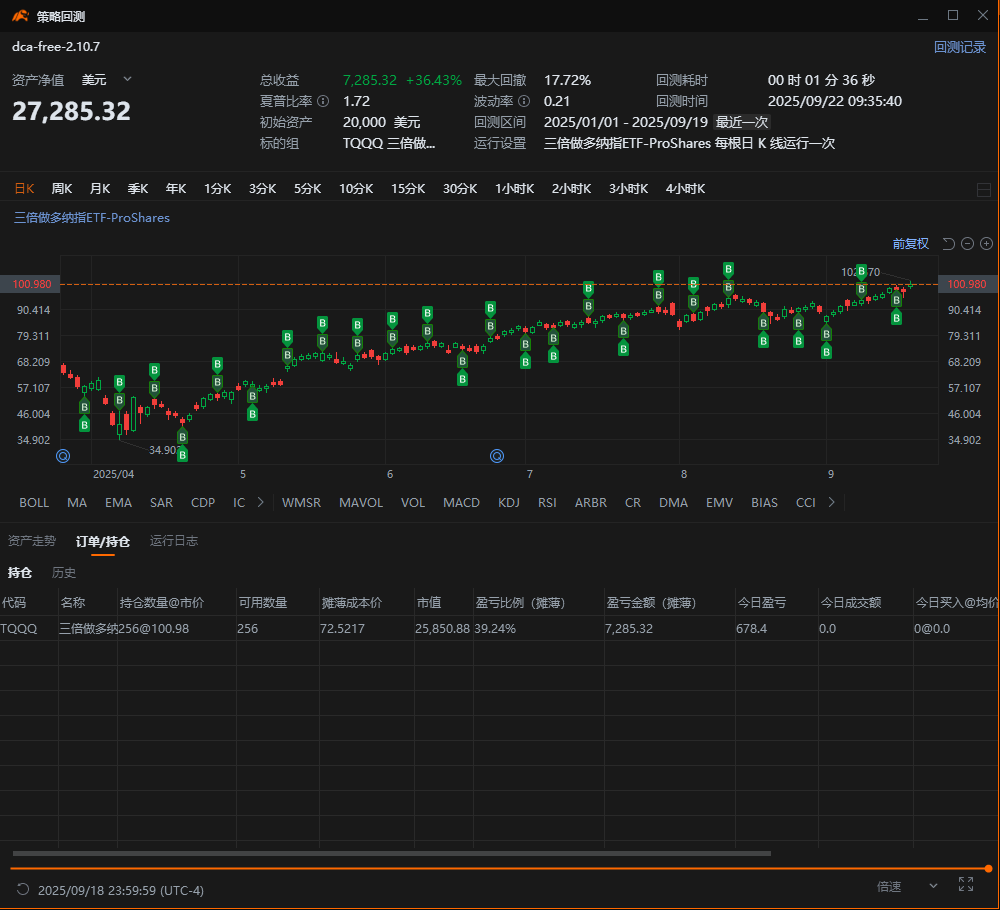

当今年4月TQQQ暴跌60%时，很多投资者选择了割肉离场。然而，坚持定投的投资者在4个月后就已收获了20%+的回报。本文通过真实回测数据，揭示了智能定投策略如何将市场恐慌转化为财富机遇。

<!-- more -->

## ⚠️ 重要风险提示

**本文不构成投资建议，仅供教育参考。**

- 🚨 **高风险警告**：TQQQ是3倍杠杆ETF，波动性极大，可能出现单日±30%的涨跌
- 📊 **标的选择**：本文以TQQQ为例进行分析，但**并非推荐**该标的
- 💰 **资金管理**：仅用闲余资金投资，做好损失本金的心理准备
- 📈 **历史不代表未来**：回测数据基于历史表现，不保证未来收益

**投资有风险，入市需谨慎。所有投资决策及后果由投资者自行承担。**

## 系列文章导航

本文是TQQQ定投策略系列的第1篇，整个系列包括：
- **第1篇：回测分析——从-60%回撤到盈利**（本文）
- [第2篇：TQQQ定投深度剖析：为什么周投能赢日投？](./DCA-03-weekly-vs-daily.md)
- [第3篇：开源定投策略改造指南：从使用者到创造者](./DCA-04-strategy-modification.md)

---

## 引言：当市场恐慌时，机会正在酝酿

2025年2-4月，科技股经历了两波惨烈的调整。纳斯达克指数连续下跌，作为3倍杠杆ETF的TQQQ更是雪上加霜，从$90暴跌至最低$35，跌幅超过60%。

特别是4月3-4日连续两天分别暴跌16%和18%，社交媒体上充斥着"杠杆ETF归零"的恐慌言论，许多投资者在极度恐惧中选择了止损离场。

接下来的回测数据将展示，坚持定投的投资者如何在两波暴跌后获得33-51%的账户收益。

## 1. 真实回测数据：恐慌后的惊喜

> 📊 **数据声明**：
> - 本文所有数据基于Moomoo量化平台回测
> - 测试周期：2025年1月1日至9月19日
> - **重要提醒**：历史表现不代表未来，请独立验证后再做投资决策

### 1.1 策略背景说明

我们基于Moomoo量化平台开发了两个版本的智能定投策略，在2025年的波动行情下进行了充分验证：

- **免费版**：完整功能的3层回撤系统，完全开源，可自由改造升级
- **完整版**：作者个人使用的7层系统，包含个性化参数调优（提供定制参考）

> 💡 **设计理念**：
> - 免费版已具备完整的定投功能，足以应对常规市场
> - 源码完全开放，鼓励用户基于免费版自主升级改进
> - 完整版分享的是作者经过大量回测后的个人参数组合
> - 两个版本的核心逻辑相同，差异在于参数深度和个性化程度

> 📌 **重要操作提示**：
> - Moomoo策略需要**手动启动**才能运行
> - 策略启动后会根据预设参数自动执行定投
> - ⚠️ 关闭Moomoo或电脑后，策略会停止运行
> - 重新打开后需要再次手动启动策略
> - 可同时运行多个策略（如DCA定投+网格+Wheel轮动）

本文重点展示回测数据，策略及参数的详细对比将在第2篇文章中详述。下面是证券软件Moomoo客户端量化功能示意，如果对Moomoo软件不熟悉的，可以先参考[这里](#建议先查看以下内容)，简单说就是找到下图所示的Moomoo功能。

并熟悉如下图所示的，完成回测后显示的三个部分：

> 📢 **实盘验证进行中**：
> - 我们已开始运行多策略实盘账户，请保持关注
> - 每天早上手动启动所有策略运行（本篇只介绍定投）
> - 不定期与读者分享真实交易及相关策略运行情况
> - 回测是历史，实盘是未来，让我们一起见证策略的真实表现！

### 1.2 免费版定投表现（截至9月19日）

**$5,000小资金定投**
- 基础定投量：1股/周
- 总收益率：**+33.67%**
- 最大回撤：15.64%
- 持仓数量：60股
- 平均成本：$72.92（当前价$100.98）

**$20,000中等资金定投**
- 基础定投量：5股/周
- 总收益率：**+36.43%**
- 最大回撤：16.8%
- 持仓数量：256股
- 平均成本：$72.52
- 

> ⚠️ **风险提醒**：16.8%回撤 = $3,360损失
> - 这可能是你两个月的房租
> - 问问自己：能接受吗？

**$40,000大资金定投**
- 基础定投量：10股/周
- 总收益率：**+36.23%**
- 最大回撤：16.9%
- 持仓数量：509股
- 平均成本：$72.51
- 

### 1.3 完整版智能定投表现

**$40,000周投（完整版）**
- 基础定投量：5股/周
- 总收益率：**+51.15%**
- 最大回撤：18.65%
- 激进乘数：1.0-2.0x动态调节
- 关键特点：4月暴跌触发深度加仓
- 

> 🔴 **中等资金也不轻松**：18.65%回撤 = $7,460账面损失
> - 想象早上起来发现账户少了一个月工资
> - 4月最恐慌时，该账户一度浮亏超过$10,000

**$800,000日投（大资金案例）**
- 基础定投量：20股/日
- 总收益率：**+50.80%**
- 最大回撤：17.61%
- 持仓数量：11,760股

> ⚠️ **巨额资金风险警示**：
> - **17.61%回撤 = $140,880的账面损失**！
> - 你能承受连续几周每天亏损$1-2万美元而不恐慌卖出吗？
> - 4月3-4日两天，该账户亏损超过$10万美元
> - 📌 如果看到这些数字让你感到不适，请立即降低投资金额

### 1.4 关键数据对比

| 策略版本 | 初始资金 | 收益率 | 最大回撤 | 平均成本 |
|---------|---------|--------|---------|---------|
| 免费版 | $5,000 | +33.67% | 15.64% | $72.92 |
| 免费版 | $20,000 | +36.43% | 16.8% | $72.52 |
| 完整版 | $40,000 | +51.15% | 18.65% | $66.01 |
| 完整版 | $800,000 | +50.80% | 17.61% | $66.42 |

> 💡 **核心发现**：
> 1. 定投策略在极端行情下依然有效
> 2. 完整版在深度回撤时优势明显
> 3. 大资金无收益衰减，保持稳定表现

## 2. 两波暴跌：如何在恐慌中保持定力？

### 2.1 暴跌的残酷现实

**第一波暴跌**（2月19日-3月11日）：
- 从$90跌至$58，跌幅35.6%
- 持续时间：3周
- 投资者心态："是调整还是崩盘？"

**第二波暴跌**（3月26日-4月7日）：
- 从$58跌至$35，跌幅39.7%
- 4月3日单日暴跌16%
- 4月4日继续暴跌18%
- 投资者心态：彻底恐慌

**累计跌幅**：从$90到$35，最大回撤61.1%

### 2.2 真实的心理煎熬

> 🧠 **不同资金规模的心理压力**：
>
> **如果你投了$10,000**：
> - 2月19日：账户$10,000 → "还好，正常波动"
> - 3月11日：账户$6,400（-36%）→ "损失$3,600，该止损？"
> - 4月4日：账户$3,900（-61%）→ "亏了$6,100！"
> - 内心独白："我的半年积蓄没了..."
>
> **如果你投了$100,000**：
> - 3月11日：浮亏$36,000 → "一辆特斯拉Model 3没了"
> - 4月4日：浮亏$61,000 → "一年的工资蒸发了"
> - 家人质疑："你在赌博吗？"

### 2.3 定投策略的应对

智能定投策略在恐慌时刻展现了它的威力：

**免费版表现**：
- 坚持每周定投，不改变节奏
- 在$30-35区间持续买入
- 平均成本大幅降低至$72
  

**完整版表现**：
- 自动触发深度回撤加仓
- 在最恐慌时刻大举买入
- 成本控制在$66左右

### 2.4 数据说话：坚持的回报

**关键买入点收益**（截至9月19日$100.98）：

**第一波低点买入**（3月11日）：
- 买入价：~$58 → 收益+74%

**第二波低点买入**（4月3-7日）：
- 4月3日：~$42 → 收益+140%
- 4月4日：~$35 → 收益+189%
- 4月7日：$36.75（最低点）→ 收益+175%

当时TQQQ的日K线如下图，你还能坚持吗？

> 💡 **最重要的教训**：你永远无法预测底部。定投的意义在于，你不需要预测，只需要坚持。

## 3. 心理建设：正确面对极端波动

### 3.1 预期管理

TQQQ是3倍杠杆，大跌是必然会发生的：
- QQQ跌20% = TQQQ跌60%（这是数学，不是灾难）
- 历史上多次60%+回撤，每次都恢复了
- 关键是你的资金配置和心理准备

### 3.2 残酷的真相测试

请诚实回答以下问题：
1. 你能接受账户连续3个月为负吗？
2. 你能承受每天看到账户亏损$1,000+吗？
3. 当亏损达到30%时，你会失眠吗？
4. 当亏损达到50%时，会影响工作吗？
5. 你的家人知道并支持这项投资吗？

**如果有任何一题答"不能"**：
- 立即减少投资金额
- 或改投SPY/VOO等低波动标的
- 记住：心理健康比赚钱更重要

### 3.3 成功的关键：执行力

导致定投失败的最大原因不是策略，而是**执行**：
- 在底部恐慌卖出（错过反弹）
- 在高位停止定投（失去平均成本效应）
- 频繁调整策略（破坏复利积累）

**量化策略的执行优势**：
- 🎯 **不用纠结时机**：策略自动判断买入时机
- ⏰ **避免遗漏投资**：只要记得每天启动策略即可
- 🧠 **消除心理负担**：不用盯盘，不用判断高低
- 💪 **纪律性执行**：避免手工定投时的犹豫和拖延

> 💡 **对比手工定投**：
> - 手工定投者："今天是涨是跌？现在买合适吗？再等等？"
> - 量化定投者："打开Moomoo，启动策略，完成！"
> - 结果：手工定投者常因纠结而错过，量化执行从不缺席

**记住**：平庸的策略+完美的执行，远胜于完美的策略+平庸的执行。

## 4. 写在最后：纸面富贵vs真实压力

看到"50%收益"很诱人，但请记住：
- **收益是事后的，压力是实时的**
- **赚50%需要8个月，亏50%只需2个月**
- **账面浮盈不是真钱，账面浮亏却是真压力**

🎯 **黄金法则**：
- 只投资你5年内不需要的钱
- 只投资损失后不影响生活的钱
- 只投资你完全理解风险的产品

**记住这个数据**：即使经历60%回撤，坚持定投的投资者（截至9月19日）已获得33-51%的正收益。这就是定投的魔力——它把时间变成朋友，把波动变成机遇。

---

## 如果您不熟悉证券软件Moomoo，建议可以先查看以下内容：
- [为什么普通人应该现在就开始投资美股？](https://zhurong2020.github.io/post/wei-shi-me-pu-tong-ren-ying-gai-xian-zai-jiu-kai-shi-tou-zi-mei-gu-yi-ge-you-ni-zhong-nian-de-zhen-shi-zhuan-xing-ji/)
- [打造你的第一个量化交易机器人 - Moomoo平台环境搭建指南](https://zhurong2020.github.io/post/da-zao-ni-de-di-yi-ge-liang-hua-jiao-yi-ji-qi-ren-moomoo-ping-tai-huan-jing-da-jian-zhi-nan/)
- [智能投资指南：手把手教你用量化工具定投美股](https://zhurong2020.github.io/post/zhi-neng-tou-zi-zhi-nan-shou-ba-shou-jiao-ni-yong-liang-hua-gong-ju-ding-tou-mei-gu/)
- [AI助力量化交易：从0到1打造Moomoo自动交易策略](https://zhurong2020.github.io/post/ai-zhu-li-liang-hua-jiao-yi-cong-0-dao-1-da-zao-moomoo-zi-dong-jiao-yi-ce-lue/)

## 下一篇预告

在第2篇文章中，我们将深入剖析：
- 为什么TQQQ适合定投？
- 周投vs日投的数据对比
- 免费版vs完整版的详细差异
- 如何选择适合自己的策略

---

**免责声明**：
- 本文仅供教育参考，不构成任何投资建议
- 投资有风险，入市需谨慎
- 所有投资决策及后果由投资者自行承担

**作者简介**：前银行从业者，现专注于量化投资研究。通过系统化策略和数据驱动决策，帮助普通投资者实现财富稳健增长。

如果你觉得这篇文章对你有帮助，欢迎分享给更多朋友。

**#TQQQ #定投策略 #量化投资 #美股投资 #风险管理**