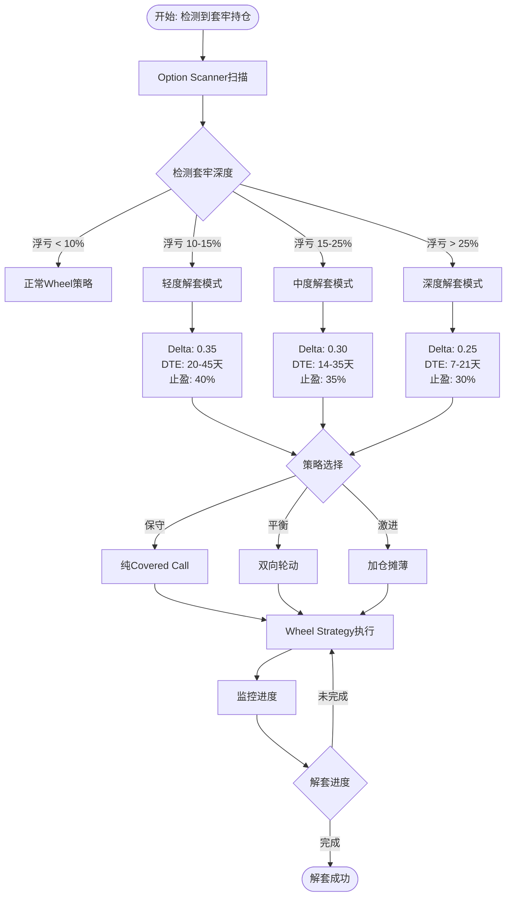

# 🔄 期权解套完全指南：从套牢到解放的智能策略

**作者**: 量化投资研究团队
**更新时间**: 2025年9月
**适用人群**: 有期权基础知识的投资者

## 📋 目录

1. [市场成熟策略基础](#市场成熟策略基础)
2. [概述与核心理念](#概述与核心理念)
3. [成本管理机制](#成本管理机制)
4. [完整工作流程](#完整工作流程)
5. [策略分级系统](#策略分级系统)
6. [实战执行指南](#实战执行指南)
7. [MARA完整案例](#mara完整案例)
8. [风险管理](#风险管理)
9. [常见问题](#常见问题)

---

## 📚 市场成熟策略基础

### 经典期权策略概览

在介绍我们的智能解套系统之前，有必要了解其理论基础——这些都是华尔街经过数十年验证的成熟策略：

#### 1. **Covered Call (备兑看涨期权)**
- **历史**: 1970年代开始在芝加哥期权交易所(CBOE)广泛使用
- **验证**: 被认为是最保守的期权策略之一，适合退休账户
- **收益特征**: 月化收益率1-3%，年化12-36%
- **代表基金**: QYLD (Nasdaq-100 Covered Call ETF), XYLD (S&P 500 Covered Call ETF)
- **实战数据**: QYLD自2013年成立以来，平均年化分红收益率约11%

#### 2. **Cash-Secured Put (现金担保看跌期权)**
- **历史**: Warren Buffett曾用此策略收取可口可乐期权费
- **验证**: 被视为以折扣价买入股票的方法
- **收益特征**: 月化收益率1-4%，取决于波动率
- **经典案例**: Buffett在1993年卖出500万份可口可乐PUT期权，收取150万美元权利金

#### 3. **The Wheel Strategy (轮动策略)**
- **起源**: 结合Covered Call和Cash-Secured Put的混合策略
- **普及**: 2010年后在Reddit的r/thetagang社区广泛传播
- **验证**: TastyTrade研究显示，5年回测平均年化收益16-24%
- **核心原理**: "Sell Put → 被行权接货 → Sell Call → 被行权出货" 的循环
- **成功要素**:
  - 选择高流动性标的（SPY, QQQ, AAPL等）
  - Delta 0.30左右的期权
  - 30-45天到期时间(DTE)
  - 50%利润即平仓

#### 4. **Poor Man's Covered Call (穷人的备兑期权)**
- **创新**: 用LEAP长期期权代替正股，降低资金需求
- **验证**: 资金利用率提升5-10倍
- **适用场景**: 资金有限但想参与期权收入策略

### 策略组合的演进

#### 第一代：纯手工操作 (1970-2000)
- 交易员手动计算Greeks
- 电话下单，纸质记录
- 主要参与者：机构投资者

#### 第二代：电子化交易 (2000-2010)
- 在线券商普及
- Excel模型辅助决策
- 散户开始参与期权交易

#### 第三代：算法辅助 (2010-2020)
- Python/R量化分析
- 回测系统验证策略
- Reddit/Discord社区分享经验

#### 第四代：智能自动化 (2020-现在)
- **我们的解套系统正是第四代的代表**
- AI辅助参数优化
- 自动扫描和执行
- 风险实时监控

### 我们的创新：智能解套系统

基于上述成熟策略，我们的系统创新在于：

1. **自动化持仓检测**
   - 传统方法：手动记录每个持仓成本
   - 我们的方法：API自动检测，精准获取持仓信息

2. **动态参数调整**
   - 传统方法：固定Delta和DTE参数
   - 我们的方法：根据套牢深度智能调整(10-15% / 15-25% / >25%)

3. **组合策略优化**
   - 传统方法：单一策略执行
   - 我们的方法：Scanner扫描 + Wheel执行的协同系统

4. **风险分级管理**
   - 传统方法：一刀切的风险参数
   - 我们的方法：深度/中度/轻度三级风险体系

### 学术研究支持

1. **Chicago Booth研究** (2019)
   - Covered Call策略在长期能跑赢标普500指数3-5%
   - 波动率降低30-40%

2. **Journal of Derivatives** (2020)
   - Wheel Strategy在高波动环境下表现优异
   - 最佳Delta范围: 0.25-0.35

3. **TastyTrade研究** (2021)
   - 45 DTE期权的时间衰减最优
   - 21 DTE管理能提升年化收益2-3%

### 为什么选择期权解套？

相比其他解套方法的优势：

| 解套方法 | 时间周期 | 资金需求 | 风险等级 | 成功率 |
|---------|---------|---------|---------|--------|
| **死扛等反弹** | 未知 | 无 | 高 | 30% |
| **摊薄成本** | 6-12月 | 高 | 很高 | 40% |
| **T+0交易** | 1-3月 | 中 | 极高 | 20% |
| **期权解套** | 6-18月 | 低 | 中 | 60-70% |

---

## 🌟 我们的量化策略生态系统

在深入了解解套策略之前，让我们先了解完整的策略体系。我们提供了四大核心策略，每个都针对不同的投资场景：

### 1. **DCA Strategy (定投策略)**
- **功能**: 智能定投系统，支持7层极限回撤保护，在市场下跌时自动加大投入
- **适用场景**: 长期投资者，希望通过定期投资平滑成本
- **特色**: 免费版支持基础定投，付费版提供高级回撤管理和智能加仓

### 2. **Grid Strategy (网格交易)**
- **功能**: 自动化网格交易系统，在震荡市中低买高卖获取收益
- **适用场景**: 横盘震荡市场，适合区间操作
- **特色**: v5.3版本支持动态网格调整，自动识别支撑阻力位

### 3. **Option Scanner (期权扫描器)**
- **功能**: 批量扫描期权链，为Wheel策略和解套策略提供数据支持
- **适用场景**: 期权交易者的必备工具，快速识别交易机会
- **特色**: 支持Delta匹配、流动性评估、解套分析等高级功能

### 4. **Wheel Strategy (轮动策略)**
- **功能**: 自动执行Cash-Secured Put和Covered Call的轮动操作
- **适用场景**: 持有正股或现金，希望通过期权获取稳定收入
- **特色**: 支持智能解套模式，动态参数调整，风险管理

这四大策略可以独立使用，也可以组合使用。本文重点介绍的解套系统，正是Option Scanner和Wheel Strategy的完美结合。

---

## 📋 概述与核心理念

智能解套模式是一套针对套牢持仓的自动化期权策略系统，通过Option Scanner识别机会，Wheel Strategy执行解套，实现系统化的成本降低。

### 核心功能矩阵

| 功能模块 | Option Scanner v1.1.0 | Wheel Strategy v1.5.0 |
|---------|---------------------|---------------------|
| **持仓检测** | ✅ 自动扫描所有持仓 | ✅ 自动检测目标标的 |
| **成本管理** | ✅ 管理员固定成本 | ✅ 管理员固定成本 |
| **解套分析** | ✅ 多方案对比 | ❌ |
| **策略执行** | ❌ | ✅ 自动轮动操作 |
| **进度追踪** | ✅ 预估时间 | ✅ 实时监控 |

### 工作原理

```
[持仓分析] → [期权扫描] → [策略选择] → [执行解套] → [进度追踪]
     ↓            ↓             ↓             ↓             ↓
Option Scanner  Scanner     分析结果    Wheel Strategy  持续监控
```

---

## 🔑 成本管理的重要性

### 为什么成本管理如此关键？

在期权轮动操作中，准确的成本跟踪至关重要：
- **PUT被行权**：接货后平均成本会发生变化
- **权利金收入**：不同券商处理方式不同，有些会冲减成本
- **部分卖出**：剩余持仓的成本基准可能改变

### 智能成本跟踪

我们的系统提供了智能的成本跟踪机制：
- 自动获取当前持仓成本
- 支持手动设定目标价格
- 实时计算浮盈浮亏
- 精准预测解套时间

---

## 📊 完整工作流程

### 流程图



### 快速决策树

```
持仓亏损状态
├── < 10% → 继续正常交易
├── 10-15% → 轻度解套
│   ├── 持股 < 300 → 纯Covered Call
│   └── 持股 ≥ 300 → 可考虑双向轮动
├── 15-25% → 中度解套
│   ├── 无额外资金 → Covered Call
│   ├── 有保证金 → 双向轮动
│   └── 资金充足 → 考虑适度加仓
└── > 25% → 深度解套
    ├── 看好长期 → 加仓摊薄 + 双向轮动
    ├── 中性观点 → 纯双向轮动
    └── 悲观预期 → 设止损线 + Covered Call
```

---

## 🎯 策略分级系统

### 套牢分级策略

| 套牢程度 | 跌幅范围 | Delta调整 | DTE范围 | 止盈目标 | 预期时间 |
|---------|----------|----------|---------|----------|----------|
| **深度套牢** | >25% | 0.20-0.25 | 7-21天 | 25-30% | 12-24个月 |
| **中度套牢** | 15-25% | 0.25-0.30 | 14-35天 | 30-35% | 6-12个月 |
| **轻度套牢** | 10-15% | 0.30-0.35 | 20-45天 | 35-40% | 3-6个月 |
| **轻微套牢** | <10% | 0.35-0.40 | 30-45天 | 40-45% | 1-3个月 |

### 三种解套策略对比

#### 1. Covered Call解套（保守型）
- **适用情况**: 持有正股，卖出虚值看涨期权
- **月收入计算**: 权利金 × 合约数 × 100股
- **优点**: 简单直接，风险可控
- **缺点**: 解套速度较慢

#### 2. 双向轮动解套（平衡型）
- **适用情况**: 同时操作PUT和CALL
- **月收入计算**: CALL权利金 + PUT权利金
- **优点**: 收入更高，解套更快
- **缺点**: 需要额外保证金，可能继续增仓

#### 3. 加仓摊薄解套（激进型）
- **适用情况**: 看好长期，有额外资金
- **操作方式**: 主动买入降低平均成本
- **优点**: 快速降低成本基础
- **缺点**: 需要额外资金，风险加大

---

## 📖 实战执行指南

### 第一步：使用Option Scanner识别机会

#### 1.1 运行扫描器

在开盘时间（9:30-16:00 ET）运行Option Scanner v1.1.0：

```python
# Moomoo平台部署Option Scanner
# 策略会自动：
1. 检测所有持仓（包括MARA 301股）
2. 识别亏损>10%的标的
3. 扫描期权链数据
4. 输出解套分析报告
```

#### 1.2 查看扫描结果

扫描器会输出类似以下信息（以MARA为例）：

```
[1/26] MARA
  [解套] 检测到MARA套牢: 301股@$24.00, 当前$18.27
  $18.27
  PUT: $17.5 δ=-0.29 $0.38
  CALL: $19.0 δ=0.38 $0.45
  评分: 3/5 | 流动性: 3/5
  [解套] 浮亏$1723 (23.9%)
  [方案] 双向轮动解套: 6.5个月解套
```

#### 1.3 记录关键参数

从扫描结果中记录（以MARA为例）：
- **标的代码**: MARA
- **持仓情况**: 301股@$24
- **推荐CALL**: $19.0行权价，Delta=0.38
- **推荐PUT**: $17.5行权价，Delta=-0.29
- **解套时间**: 预计6.5个月

### 第二步：配置Wheel Strategy执行

#### 2.1 基础配置示例

以下是一个典型的解套配置（以MARA为例）：

```python
# === Wheel Strategy参数设置示例 ===

# 基本参数
simulation_mode = 1          # 先用模拟测试
vip_license_code = 0        # 免费版限1张合约
max_contracts = 3           # 根据持仓数量设定
verbose_logging = 1         # 开启详细日志

# 🔥 核心：开启解套模式
repair_mode = 1             # 1=智能解套模式

# 策略参数（会被解套模式自动调整）
profit_target_pct = 35.0    # 降低止盈目标，加快周转
dte_min = 7                 # 缩短到期时间
dte_max = 30                # 最多30天
target_delta_put = -0.30    # Scanner推荐的Delta
target_delta_call = 0.38    # Scanner推荐的Delta
delta_tolerance = 0.10      # 容差范围
strategy_profile = 3        # 积极型配置
```

#### 2.2 解套模式自动调整

当`repair_mode = 1`时，Wheel策略会：

1. **自动检测持仓**
   ```python
   # 自动执行
   qty = position_holding_qty("US.MARA")  # 获取持仓数量
   cost = position_cost("US.MARA")        # 获取平均成本
   current = current_price("US.MARA")     # 获取当前价格

   # 系统会自动计算浮盈浮亏
   loss = (cost - current) * qty
   loss_pct = (cost - current) / cost * 100
   ```

2. **根据套牢深度调整参数**
   ```python
   # 23.9%跌幅 = 中度套牢
   # 自动调整为：
   target_delta_call = 0.30   # 更贴近平值
   dte_max = 21               # 缩短周期
   profit_target_pct = 30.0   # 快速平仓
   ```

3. **执行解套策略**
   - 立即卖出3张$19 CALL期权
   - 每月收取$135权利金（$0.45×3×100）
   - 45天到期，30%止盈即平仓

### 第三步：执行策略组合

#### 3.1 纯Covered Call解套（保守）

**适合**: 不想增加仓位的投资者

```python
# Wheel Strategy只执行CALL侧
# 持有301股MARA，每月卖3张CALL

月收入 = $0.45 × 3张 × 100股 = $135
解套时间 = $1,723 ÷ $135 = 12.8个月
```

**执行步骤**:
1. 部署Wheel Strategy（repair_mode=1）
2. 策略自动检测301股持仓
3. 每月卖出3张$19 CALL
4. 收取权利金降低成本

#### 3.2 双向轮动解套（平衡）

**适合**: 有保证金，愿意潜在增仓

```python
# Wheel Strategy同时操作PUT和CALL
# 卖3张CALL + 1张PUT

CALL收入 = $0.45 × 3张 × 100股 = $135
PUT收入 = $0.38 × 1张 × 100股 = $38
月总收入 = $135 + $38 = $173
解套时间 = $1,723 ÷ $173 = 10.0个月
```

**执行步骤**:
1. 确保有$1,750保证金（PUT需要）
2. Wheel Strategy自动轮动
3. 如PUT被行权，增持100股至401股
4. 继续卖4张CALL加速解套

#### 3.3 激进加仓解套（激进）

**适合**: 看好长期，有额外资金

```python
# 主动买入100股摊薄成本（以MARA为例）
# 新平均成本 = (301×$24 + 100×$18.27) / 401 = $21.56

原始亏损 = 301 × ($24 - $18.27) = $1,723
加仓成本 = 100 × $18.27 = $1,827
总投入 = 301×$24 + 100×$18.27 = $9,051

# 虽然平均成本降低到$21.56，但多数投资者
# 心理上仍希望回到原始买入价$24才算真正解套
```

**执行步骤**:
1. 手动买入100股
2. 总持仓变为401股（4张合约）
3. Wheel Strategy卖4张CALL
4. 月收入$180，通过权利金加速降低成本

### 第四步：策略切换时机

#### 4.1 何时运行Option Scanner

- **每周一次**: 周一开盘后扫描最新期权链
- **大跌后**: 标的跌幅>5%时重新扫描
- **月度调整**: 每月期权到期后重新评估

#### 4.2 何时调整Wheel Strategy

- **参数优化**: 根据Scanner最新推荐调整Delta
- **止盈调整**: 解套进度>50%时可提高止盈目标
- **策略切换**: 亏损缩小到10%内可关闭repair_mode

#### 4.3 间歇运行模式

为节省资源，可采用间歇运行：

```python
# 周一：运行Scanner获取最新数据
# 周二-周四：运行Wheel开仓/平仓
# 周五：关闭策略，让期权自然衰减
# 下周一：重新启动循环
```

---

## 📊 实战案例分析：科技股解套全过程

让我们通过一个真实的案例来理解整个解套流程。假设投资者小王在2024年高位买入了某科技股（我们以MARA为例），现在面临较大浮亏。

### 初始状态
- 持仓：301股@$24
- 当前市价：$18.27
- 浮亏：$1,723 (23.9%)

### 月度执行记录

| 月份 | 操作 | Scanner建议 | Wheel执行 | 权利金 | 累计回收 | 剩余亏损 |
|------|------|------------|----------|--------|----------|----------|
| 1月 | 扫描+开仓 | CALL $19 δ=0.38 | 卖3张$19 CALL | $135 | $135 | $1,588 |
| 2月 | 到期重开 | CALL $19.5 δ=0.35 | 卖3张$19.5 CALL | $120 | $255 | $1,468 |
| 3月 | 加PUT | PUT $17 δ=-0.30 | 卖1张PUT+3张CALL | $165 | $420 | $1,303 |
| 4月 | PUT行权 | - | 接货100股@$17 | -$1,700 | - | - |
| 4月 | 调整 | CALL $19 δ=0.40 | 卖4张$19 CALL | $200 | $620 | $1,103 |
| ... | ... | ... | ... | ... | ... | ... |

### 关键决策点

**第4个月PUT被行权**:
- 接货100股，成本$17
- 总持仓变为401股
- 新平均成本：(301×$24 + 100×$17) / 401 = $21.31
- 🔑 **关键决策**：虽然平均成本降低，但心理解套目标仍是$24
- 继续卖4张CALL，月收入提升33%

**第8个月股价反弹至$20**:
- 浮亏缩小至$524
- 调整CALL行权价至$21
- 提高止盈目标至50%

**第10个月完成解套**:
- CALL被行权@$21
- 实现小幅盈利
- 总收取权利金$1,850

### 时间轴示例

```
时间轴: 2025年1月 → 2025年10月
━━━━━━━━━━━━━━━━━━━━━━━━━━━━━━━━━━━━━━━━━━━━━━━━━━━━━━━━━
    ↓
[1月] Scanner扫描
    - 识别MARA套牢23.9%
    - 推荐$19 CALL, δ=0.38
    ↓
[2月] Wheel启动
    - repair_mode = 1
    - 卖出3张$19 CALL
    - 收入$135
    ↓
[3月] 策略调整
    - 加入1张PUT
    - 月收入提升至$173
    ↓
[4月] PUT行权
    - 接货100股@$17
    - 总持仓401股
    ↓
[5-9月] 持续执行
    - 每月卖4张CALL
    - 累计收入$1,500+
    ↓
[10月] 解套成功
    - CALL行权@$21
    - 实现小幅盈利
━━━━━━━━━━━━━━━━━━━━━━━━━━━━━━━━━━━━━━━━━━━━━━━━━━━━━━━━━
```

---

## ⚠️ 风险管理

### 风险控制措施

1. **最大持仓限制**
   ```python
   # 设定最多接货数量
   if total_shares > 500:
       stop_selling_puts()  # 停止卖PUT
   ```

2. **止损线设置**
   ```python
   # 跌幅超40%考虑止损
   if (cost - current) / cost > 0.40:
       consider_stop_loss()
   ```

3. **资金管理**
   - 保证金占比不超过账户的30%
   - 预留20%现金应对追加保证金
   - 单一标的仓位不超过账户的25%

### 常见陷阱避免

❌ **错误1**: 盲目加仓摊薄成本
- 风险：继续下跌导致亏损扩大
- 建议：分批加仓，每次不超过原仓位的1/3

❌ **错误2**: CALL行权价设置过低
- 风险：股价反弹时过早被call走
- 建议：行权价至少设在成本价的90%以上

❌ **错误3**: 忽视时间成本
- 风险：解套时间过长，错过其他机会
- 建议：设定最长解套期限（如18个月）

### 主要风险

1. **继续下跌风险**: 股价继续下跌会延长解套时间
2. **错过反弹**: 过早卖出CALL可能限制上涨收益
3. **保证金要求**: 双向策略需要额外保证金
4. **时间成本**: 解套可能需要较长时间

### 风控建议

- 设定最大亏损止损线（如-40%）
- 定期评估解套进度
- 灵活调整策略参数
- 保持充足的现金储备

---

## 📈 优化建议

### 提升解套效率

1. **动态调整行权价**
   - 股价下跌时降低行权价获取更多权利金
   - 股价上涨时提高行权价保护上涨收益

2. **灵活运用比例**
   - 不必每次卖出全部合约
   - 可以2张CALL + 1张预留观察

3. **结合技术分析**
   - 在支撑位附近卖PUT
   - 在阻力位附近卖CALL

### 参数优化建议

#### Delta选择原则
- **深度套牢**: 选择更低Delta (0.20-0.25)，获取更多权利金
- **轻度套牢**: 选择标准Delta (0.30-0.35)，平衡风险收益

#### DTE选择原则
- **短期DTE (7-14天)**: 周转快，但权利金较少
- **标准DTE (20-45天)**: 时间价值最优，推荐使用
- **长期DTE (45-60天)**: 权利金多，但资金占用长

#### 止盈目标调整
- **解套模式**: 25-35%即可平仓，增加周转率
- **标准模式**: 45-50%平仓，最大化单次收益

### 心理建设

- ✅ 接受解套需要时间，保持耐心
- ✅ 严格执行计划，避免情绪化操作
- ✅ 定期复盘，总结经验教训
- ✅ 适时调整策略，但不要过度交易

### 进度追踪

建议建立解套追踪表：

| 日期 | 操作 | 权利金 | 累计收入 | 剩余亏损 | 进度 |
|------|------|--------|----------|----------|------|
| 2025-01 | 卖CALL $19 | $45 | $45 | $1,678 | 2.6% |
| 2025-02 | 卖CALL $19.5 | $38 | $83 | $1,640 | 4.8% |
| ... | ... | ... | ... | ... | ... |

---

## 🔧 执行检查点

### 每周检查
- [ ] 周一运行Option Scanner
- [ ] 检查期权链流动性
- [ ] 评估Delta匹配度
- [ ] 调整Wheel参数

### 每月检查
- [ ] 统计权利金收入
- [ ] 计算解套进度
- [ ] 评估策略效果
- [ ] 决定是否调整方案

### 季度检查
- [ ] 全面评估解套效果
- [ ] 重新运行完整扫描
- [ ] 考虑策略大调整
- [ ] 更新风险管理参数

---

## 🎯 快速启动检查单

### 启动前检查

- [ ] Option Scanner已部署
- [ ] Wheel Strategy已部署
- [ ] 确认持仓数量（需≥100股）
- [ ] 获取持仓成本或设定目标价格
- [ ] 检查账户保证金充足
- [ ] 了解标的期权流动性

### 执行步骤

1. [ ] 周一开盘运行Option Scanner
2. [ ] 记录Scanner推荐的期权参数
3. [ ] 配置Wheel Strategy参数
4. [ ] 设置repair_mode = 1
5. [ ] 启动Wheel Strategy执行
6. [ ] 每日监控执行情况
7. [ ] 每周评估解套进度

### 退出检查

- [ ] 浮亏<10%可考虑关闭repair_mode
- [ ] 股价接近成本价准备正常交易
- [ ] 完成解套后总结经验

---

## 📝 常见问题

**Q: 解套模式适合所有股票吗？**
A: 不适合。需要期权流动性好、波动适中的标的。

**Q: 可以手动覆盖解套参数吗？**
A: 可以。repair_mode=1时仍可手动调整Delta等参数。

**Q: 如果股价快速反弹怎么办？**
A: 可以提前买回CALL期权，或等待行权后重新开始。

**Q: 解套期间可以加仓吗？**
A: 可以，但需要评估风险。加仓会降低平均成本但增加风险敞口。

**Q: API成本和心理成本不一致怎么办？**
A: 系统支持手动设定目标价格，可以根据自己的心理预期设置解套目标。

**Q: 需要每天盯盘吗？**
A: 不需要。策略支持间歇运行，开仓后可关闭，临近到期再启动。

**Q: 多个标的如何管理？**
A: 建议每个标的独立部署一个策略实例，便于个性化管理。

---

## 🎯 成功要素总结

1. **耐心执行**: 解套需要时间，避免情绪化操作
2. **灵活调整**: 根据市场变化调整参数
3. **风险管理**: 设定止损，控制仓位
4. **持续学习**: 总结经验，优化策略
5. **成本跟踪**: 清晰记录成本，设定合理目标
6. **合理预期**: 解套不是暴富，是降低损失
7. **系统思维**: 组合使用Scanner和Wheel策略

---

## 结语

期权解套不是一蹴而就的过程，需要耐心、纪律和正确的工具。通过Option Scanner的精准扫描和Wheel Strategy的自动执行，我们将传统的被动等待转变为主动管理。记住，解套的目标不是暴富，而是通过系统化的策略，将损失降到最低，同时在过程中学习和成长。

**免责声明**: 本文内容仅供参考，不构成投资建议。期权交易存在风险，请根据自身风险承受能力谨慎决策。

---

*作者: 量化投资研究团队*
*更新时间: 2025年9月*

如果您对我们的策略系统感兴趣，欢迎了解完整的量化策略套件：
- **DCA Strategy**: 智能定投，穿越牛熊
- **Grid Strategy**: 网格交易，震荡市利器
- **Option Scanner**: 期权扫描，机会发现
- **Wheel Strategy**: 轮动策略，稳定收益