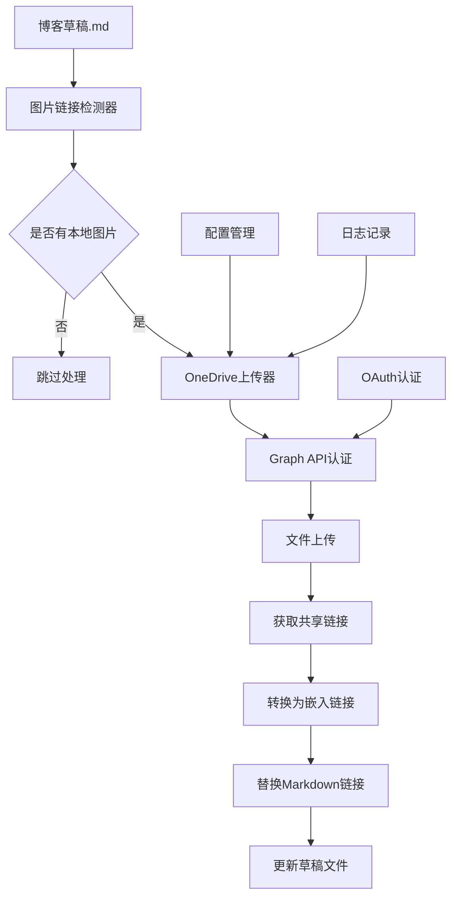

# OneDrive博客图床自动化系统设计

## 系统概述

基于Microsoft Graph API的博客图床自动化系统，实现本地图片自动上传到OneDrive并获取嵌入链接，同时替换Markdown文档中的图片链接。

## 系统架构



## 核心组件

### 1. 认证管理器 (AuthManager)
```python
class OneDriveAuthManager:
    """处理Microsoft Graph API的OAuth认证"""
    
    def __init__(self, config_path: str):
        self.config = self._load_config(config_path)
        self.token_cache = {}
    
    def get_access_token(self) -> str:
        """获取或刷新访问令牌"""
        pass
    
    def refresh_token(self) -> str:
        """刷新访问令牌"""
        pass
    
    def is_token_valid(self) -> bool:
        """检查令牌是否有效"""
        pass
```

### 2. 文件上传管理器 (UploadManager)
```python
class OneDriveUploadManager:
    """处理文件上传到OneDrive"""
    
    def __init__(self, auth_manager: OneDriveAuthManager):
        self.auth = auth_manager
        
    def upload_image(self, local_path: str, remote_path: str) -> dict:
        """上传图片到OneDrive指定路径"""
        pass
        
    def create_folder_structure(self, date_path: str) -> bool:
        """创建日期文件夹结构"""
        pass
        
    def get_sharing_link(self, file_id: str, link_type: str = 'embed') -> str:
        """获取文件的分享链接"""
        pass
```

### 3. Markdown处理器 (MarkdownProcessor)
```python
class MarkdownImageProcessor:
    """处理Markdown文件中的图片链接"""
    
    def __init__(self, upload_manager: OneDriveUploadManager):
        self.uploader = upload_manager
        
    def find_local_images(self, content: str) -> list:
        """查找Markdown中的本地图片链接"""
        pass
        
    def process_article(self, file_path: str) -> dict:
        """处理整篇文章的图片"""
        pass
        
    def replace_image_links(self, content: str, replacements: dict) -> str:
        """替换图片链接"""
        pass
```

### 4. 主控制器 (BlogImageManager)
```python
class BlogImageManager:
    """博客图床系统主控制器"""
    
    def __init__(self, config_path: str = "config/onedrive_config.json"):
        self.config = self._load_config(config_path)
        self.auth = OneDriveAuthManager(config_path)
        self.uploader = OneDriveUploadManager(self.auth)
        self.processor = MarkdownImageProcessor(self.uploader)
        
    def process_draft(self, draft_path: str) -> dict:
        """处理单个草稿文件"""
        pass
        
    def batch_process(self, drafts_dir: str) -> dict:
        """批量处理草稿目录"""
        pass
```

## 工作流程

### 博客写作工作流
```bash
1. 写作阶段:
   - 使用本地路径插入图片: 
   - 图片暂存在 assets/images/posts/YYYY/MM/ 目录

2. 处理阶段:
   - 运行: python scripts/onedrive_blog_images.py --draft _drafts/article.md
   - 系统自动上传图片到OneDrive
   - 获取嵌入链接并替换本地路径

3. 完成阶段:
   - 草稿中的图片链接已更新为OneDrive链接
   - 可选择删除本地图片文件
   - 文章准备发布
```

### OneDrive目录结构
```
/BlogImages/
├── 2025/
│   ├── 08/
│   │   ├── 20250808_信息核实方法论_01.png
│   │   ├── 20250808_信息核实方法论_02.webp
│   │   └── 20250808_信息核实方法论_03.jpg
│   └── 09/
├── thumbnails/
│   └── 2025/08/
└── metadata/
    └── upload_log.json
```

## 配置系统

### onedrive_config.json
```json
{
  "auth": {
    "tenant_id": "7fp1fj.onmicrosoft.com",
    "client_id": "your-app-client-id",
    "client_secret": "your-app-secret",
    "redirect_uri": "http://localhost:8080/callback",
    "scopes": ["https://graph.microsoft.com/Files.ReadWrite"]
  },
  "onedrive": {
    "base_folder": "/BlogImages",
    "folder_structure": "{year}/{month:02d}",
    "filename_format": "{date}_{article_title}_{index:02d}.{ext}",
    "supported_formats": [".png", ".jpg", ".jpeg", ".gif", ".webp"]
  },
  "processing": {
    "max_file_size_mb": 32,
    "compress_large_images": true,
    "create_thumbnails": true,
    "backup_originals": false
  },
  "links": {
    "type": "embed",
    "width": 800,
    "height": null,
    "quality": "auto"
  }
}
```

## Microsoft Graph API集成

### 认证流程
```python
# OAuth 2.0 授权码流程
1. 用户访问授权URL
2. 用户登录并授权
3. 获取授权码
4. 交换访问令牌
5. 存储令牌以供后续使用
```

### 关键API端点
```python
# 文件上传
PUT /drive/root:/BlogImages/{path}/{filename}:/content

# 获取共享链接
POST /drive/items/{item-id}/createLink
{
    "type": "embed",
    "scope": "anonymous"
}

# 创建文件夹
POST /drive/root:/BlogImages/{folder-path}
{
    "name": "{folder-name}",
    "folder": {}
}
```

### 错误处理和重试
```python
class RetryableError(Exception):
    pass

def with_retry(max_retries=3, backoff=1.0):
    def decorator(func):
        def wrapper(*args, **kwargs):
            for attempt in range(max_retries):
                try:
                    return func(*args, **kwargs)
                except RetryableError:
                    if attempt == max_retries - 1:
                        raise
                    time.sleep(backoff * (2 ** attempt))
        return wrapper
    return decorator
```

## 链接格式转换

### OneDrive链接类型
```python
# 原始共享链接
https://1drv.ms/i/s!xxx

# 直接访问链接  
https://onedrive.live.com/download?resid=xxx

# 嵌入链接 (推荐)
https://onedrive.live.com/embed?resid=xxx&authkey=xxx&width=800
```

### 链接转换器
```python
class OneDriveLinkConverter:
    @staticmethod
    def to_embed_link(share_url: str, width: int = 800, height: int = None) -> str:
        """将共享链接转换为嵌入链接"""
        pass
        
    @staticmethod
    def extract_resource_id(share_url: str) -> str:
        """从共享链接提取资源ID"""
        pass
```

## 性能优化

### 批量处理优化
- 并发上传多个文件
- 复用HTTP连接
- 智能重试机制
- 本地缓存减少API调用

### 文件处理优化
- 图片格式自动转换
- 智能压缩算法
- 缩略图生成
- 重复文件检测

## 安全考虑

### 认证安全
- 令牌安全存储
- 定期令牌刷新
- 权限最小化原则

### 数据安全
- 传输加密 (HTTPS)
- 敏感信息不记录
- 错误信息脱敏

## 集成到现有工作流

### run.py集成
```python
# 在run.py中添加图片处理步骤
def process_draft_images(draft_path: str):
    """处理草稿中的图片"""
    from scripts.tools.onedrive_blog_images import BlogImageManager
    
    manager = BlogImageManager()
    result = manager.process_draft(draft_path)
    
    if result['success']:
        print(f"✅ 处理了 {result['images_processed']} 张图片")
    else:
        print(f"❌ 图片处理失败: {result['error']}")
```

### Jekyll插件集成
```ruby
# _plugins/onedrive_images.rb
Jekyll::Hooks.register :posts, :pre_render do |post|
  # 检查并处理OneDrive图片链接
end
```

## 监控和日志

### 日志记录
- 上传成功/失败记录
- API调用统计
- 性能指标监控
- 错误详情记录

### 使用统计
- 存储空间使用情况
- API调用频率
- 图片访问统计
- 续订活动证明

## 部署和维护

### 初始化设置
```bash
# 1. 在Azure Portal注册应用
# 2. 配置OAuth重定向URI
# 3. 获取客户端凭据
# 4. 运行初始认证

python scripts/tools/onedrive_blog_images.py --setup
```

### 日常维护
- 定期检查令牌状态
- 清理过期缓存
- 监控存储使用情况
- 备份配置文件

这个系统设计充分利用了你的Microsoft 365 E5 Developer订阅，同时确保合规的开发使用，为博客图床提供强大的自动化支持。